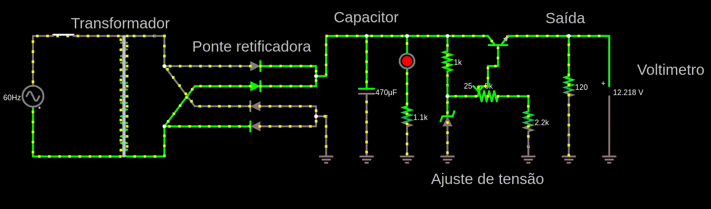
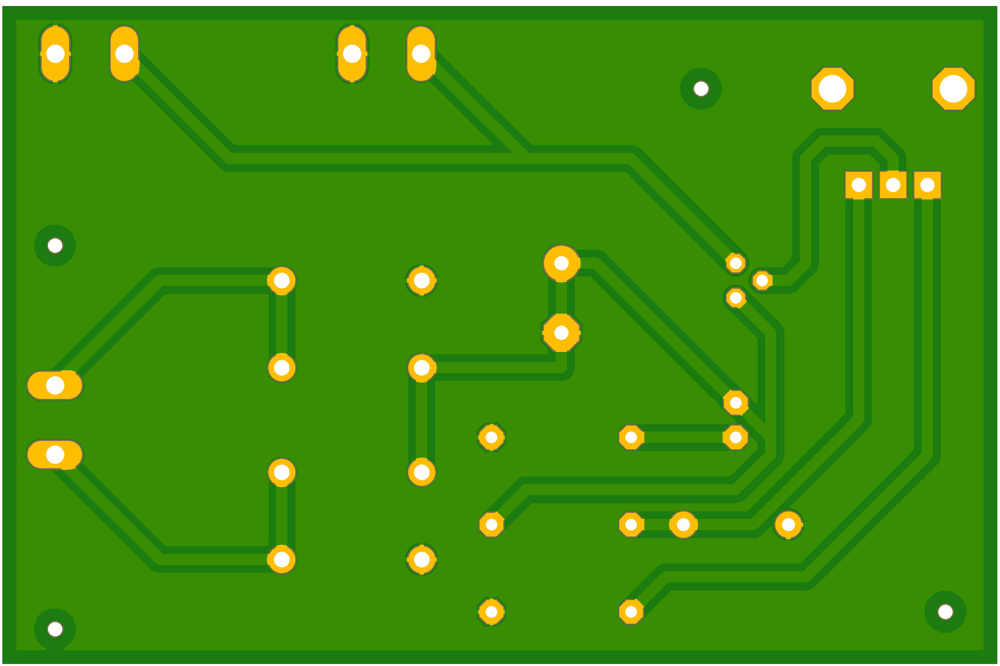
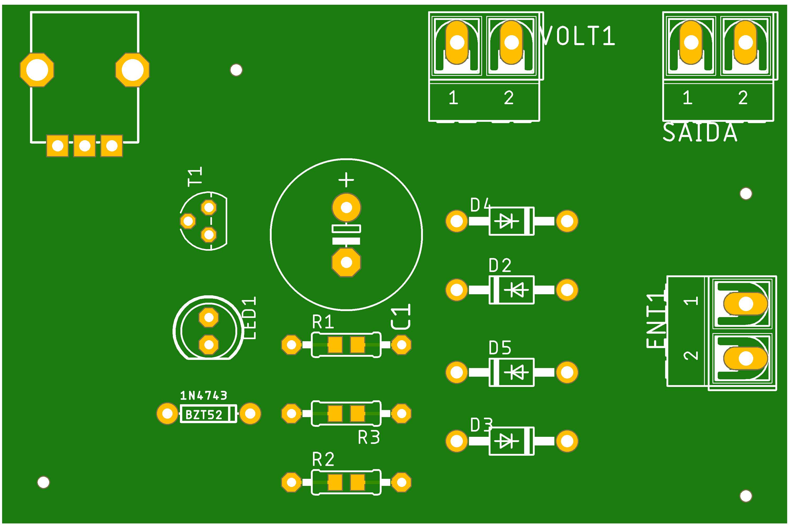

  
# Fonte de tensão ajustável

  
##  Lista de componentes

|Quantidade| Componente        | Especificações/tipo | Valor |
| :---     | :---              |     :---:           | :---  |
|    1     | [Resistor](https://www.baudaeletronica.com.br/resistor-2k0-5-2w.html) 		   | 2KΩ                |   R$0,23    |
|    1     | [Capacitor](https://www.baudaeletronica.com.br/capacitor-eletrolitico-470uf-35v.html)		   | 470 µF              |  R$1,09     |
|    2     | [Resistor](https://www.baudaeletronica.com.br/resistor-1k8-1-2w.html)		   | 1KΩ                  |     R$0,14  |  
|    4     | [Diodo](https://www.baudaeletronica.com.br/diodo-6a10.html)			   | [6A10](https://storage.googleapis.com/baudaeletronicadatasheet/6A10.pdf)			 |     R$0,86   |
|    1     | [Diodo Zener](https://www.baudaeletronica.com.br/diodo-zener-1n4743-13v-1w.html)	   | [1N4743](https://www.baudaeletronica.com.br/diodo-zener-1n4743-13v-1w.html)		     |   R$0,20    |
|    1     | [LED](https://www.baudaeletronica.com.br/led-de-alto-brilho-azul.html)			   | Alto Brilho         |  R$0,28     |
|    1     | [Potenciômetro](https://www.baudaeletronica.com.br/potenciometro-linear-de-5k-5000.html)   | 5KO              |     R$1,09   | 
|    1     | [Transistor](https://www.baudaeletronica.com.br/transistor-npn-bc337.html)       | [BC337](https://storage.googleapis.com/baudaeletronicadatasheet/BC337.PDF)             |    R$0,17   |
|    1     | [Transformador](https://www.baudaeletronica.com.br/transformador-trafo-1a-24v.html)   | 24V ou +12V/-12V    |   R$36,00    | 
| 1 | [Chave gangorra](https://www.baudaeletronica.com.br/chave-gangorra-kcd3-102n-verde-com-neon-sem-marcac-o.html)| - | R$1,85
| 3 | [Conector](https://www.baudaeletronica.com.br/borne-2-polos-kf-301-2t.html)| Borne | R$0,76
| 1 | [*Display](https://br.banggood.com/Geekcreit-Mini-Digital-Voltmeter-Ammeter-DC-100V-10A-Voltmeter-Current-Meter-Tester-BlueRed-Dual-LED-Display-p-1416489.html?gpla=1&gmcCountry=BR&currency=BRL&createTmp=1&utm_source=googleshopping&utm_medium=cpc_bgs&utm_content=lijing&utm_campaign=ssc-brg-all-1014-newcustom-re0327&ad_id=389344072730&gclid=Cj0KCQjwz4z3BRCgARIsAES_OVd-WYtEYyOGJNCb5vra89DurCnhwjkIOx-fQ4ghT_pFcfvKb8wn5VMaAvMDEALw_wcB&cur_warehouse=CN)| - | R$15,58

* *Obs: O display é opcional

## Imagens

### Simulação da fonte
* link: http://tinyurl.com/yaesx462

 
### Diagrama da fonte

### Esquemático da fonte

### Parte de baixo da placa de circuito

### Topo da placa de circuito 

## Vídeo 

## Participantes

* **Matheus Vieira Gonçalves** - [Math-42](https://github.com/Math-42)

* **Pedro Henrique Dias Junqueira**  - [pedrohdjs](https://github.com/pedrohdjs)

